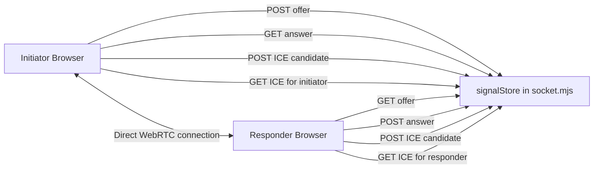
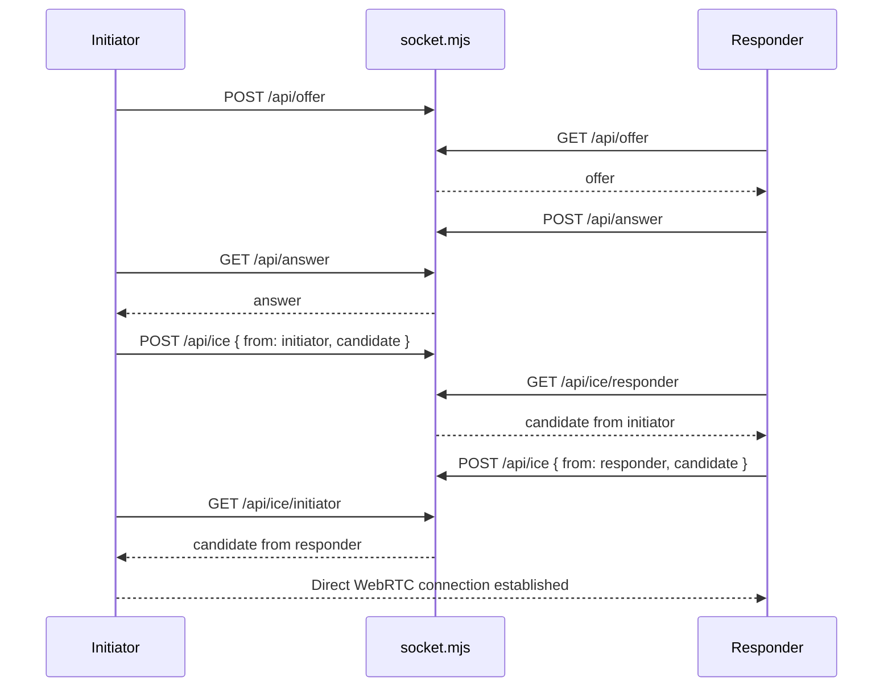

# README-ICE

## Overview

`socket.mjs` is a small Node.js + Express signaling server used to help two browsers establish a WebRTC connection.

It does **not** carry live audio, video, or translated media.

Its only job is to help two peers exchange the setup information required for a direct peer-to-peer connection.

In this project, `socket.mjs` is a **signaling layer for testing**. Once signaling is complete and WebRTC connects, media and data move directly between peers.

## What `socket.mjs` Does

The server provides four core functions:

1. Serves the WebRTC test page.
2. Stores the SDP offer from the initiator.
3. Stores the SDP answer from the responder.
4. Queues ICE candidates so each peer can retrieve the candidates intended for it.

It also provides a reset endpoint so testing can start from a clean state.

## Core Concepts

### 1. WebRTC

WebRTC is a browser technology that allows two peers to communicate directly.

It supports:

1. Audio
2. Video
3. Data channels

A WebRTC connection usually needs a signaling step first. That is where `socket.mjs` is used.

### 2. Signaling

Signaling is the process of exchanging connection setup messages before the peer-to-peer connection is active.

These messages include:

1. `offer`
2. `answer`
3. `ICE candidates`

Signaling is **not** built into WebRTC itself. Applications must provide their own signaling server. In this project, that server is `socket.mjs`.

### 3. SDP Offer and Answer

SDP stands for Session Description Protocol.

It describes how two peers want to communicate, including things like:

1. media types
2. codecs
3. transport details
4. connection direction

Flow:

1. The initiator creates an `offer`.
2. The responder receives the offer and creates an `answer`.
3. The initiator receives the answer.

After this, both peers know the initial connection parameters.

### 4. ICE

ICE stands for Interactive Connectivity Establishment.

Its purpose is to help two peers find a working network path between them.

Browsers often sit behind:

1. NAT
2. routers
3. firewalls

Because of that, a peer usually has multiple possible addresses. ICE gathers these addresses and tries them until a working path is found.

ICE candidates can represent:

1. local network addresses
2. public addresses discovered through STUN
3. relay addresses provided by TURN

### 5. STUN and TURN

ICE commonly works with:

1. STUN
2. TURN

**STUN** helps a peer discover its public-facing network address.

**TURN** relays traffic through a server when direct peer-to-peer connection is not possible.

`socket.mjs` does not implement STUN or TURN. It only helps exchange the signaling data needed so the browser can use ICE with configured STUN/TURN servers.

## High-Level Architecture



## Runtime Architecture



## Internal State Model

`socket.mjs` uses a single in-memory object:

```js
const signalStore = {
  offer: null,
  answer: null,
  candidatesToInitiator: [],
  candidatesToResponder: []
};
```

### Why the state is designed this way

#### Sticky `offer`

The offer is **not removed** when the responder reads it.

Reason:

1. The responder may poll multiple times.
2. The server should keep returning the same offer until reset.
3. This avoids losing the initial handshake message.

#### Sticky `answer`

The answer is also **not removed** when the initiator reads it.

Reason:

1. The initiator may poll more than once.
2. The same answer should remain available until reset.

#### Queued ICE candidates

ICE candidates are stored in role-specific arrays and removed with `shift()` when consumed.

Reason:

1. ICE candidates are one-time incremental messages.
2. They may arrive over time.
3. Each peer should receive only the candidates meant for it.


## How to Run

### Install dependencies:
```bash
npm install
```

### Start the signaling server:

```bash
node socket.mjs`
```

### Open the test page in two browser windows:

1. http://localhost:3000
2. In one window, choose Initiator.
3. In the other window, choose Responder.
4. Start the WebRTC flow and wait for the connection to be established.
5. For testing on another device on the same network, open: http://<your-local-ip>:3000
6. If the connection gets stuck or you want a fresh test, call the reset flow and restart the handshake.


## Endpoint Reference

### `GET /`

Serves the `webrtc-test.html` page.

### `POST /api/offer`

Stores the initiator's SDP offer.

### `GET /api/offer`

Returns the stored offer to the responder.

If no offer exists yet, returns:

```json
{ "waiting": true }
```

### `POST /api/answer`

Stores the responder's SDP answer.

### `GET /api/answer`

Returns the stored answer to the initiator.

If no answer exists yet, returns:

```json
{ "waiting": true }
```

### `POST /api/ice`

Stores an ICE candidate.

Request body format:

```json
{
  "from": "initiator",
  "candidate": { "candidate": "..." }
}
```

or:

```json
{
  "from": "responder",
  "candidate": { "candidate": "..." }
}
```

Routing logic:

1. candidates from the initiator are queued for the responder
2. candidates from the responder are queued for the initiator

### `GET /api/ice/:role`

Returns one ICE candidate for the requesting role.

Examples:

1. `GET /api/ice/initiator`
2. `GET /api/ice/responder`

If no candidate is ready yet, returns:

```json
{ "waiting": true }
```

### `POST /api/reset`

Clears all signaling state:

1. `offer`
2. `answer`
3. `candidatesToInitiator`
4. `candidatesToResponder`

This is useful when starting a new test session.

## Connection Lifecycle

The full connection lifecycle looks like this:

1. User opens the test page in two browser windows or devices.
2. Initiator creates an offer and sends it to the server.
3. Responder polls until the offer is available.
4. Responder creates an answer and sends it to the server.
5. Initiator polls until the answer is available.
6. Both peers generate ICE candidates over time.
7. Each peer posts its ICE candidates to the server.
8. Each peer polls the server for candidates meant for its role.
9. Once ICE finds a working path, the peer-to-peer connection is established.
10. After that, browser peers communicate directly.

## Important Technical Notes

### `socket.mjs` is not a media relay

The server does not stream:

1. microphone audio
2. speaker audio
3. translation audio
4. data channel payloads after connection

It only supports the handshake phase.

### In-memory state only

All signaling data is stored in memory.

That means:

1. restarting the server clears all state
2. multiple sessions are not isolated
3. data is not durable

### Polling-based signaling

Peers retrieve data by polling HTTP endpoints.

This is simple and good for testing, but not ideal for production because:

1. it adds latency
2. it wastes requests while waiting
3. it does not scale well compared to WebSocket or realtime pub/sub signaling

## Limitations

This implementation is intentionally simple.

It does **not** provide:

1. authentication
2. session isolation for many users
3. persistent storage
4. secure production-grade signaling
5. WebSocket-based push delivery
6. TURN server functionality

## When to Use This File

Use `socket.mjs` when you want:

1. quick local WebRTC handshake testing
2. two-browser or two-device experiments
3. a simple example of offer/answer + ICE exchange

Do not treat it as the full backend for a production application.

## Summary

`socket.mjs` is a lightweight signaling server that:

1. serves the WebRTC test page
2. stores offer and answer messages
3. queues ICE candidates for each peer role
4. enables two browsers to establish a direct WebRTC connection

Its role ends once the peer-to-peer connection is established.


